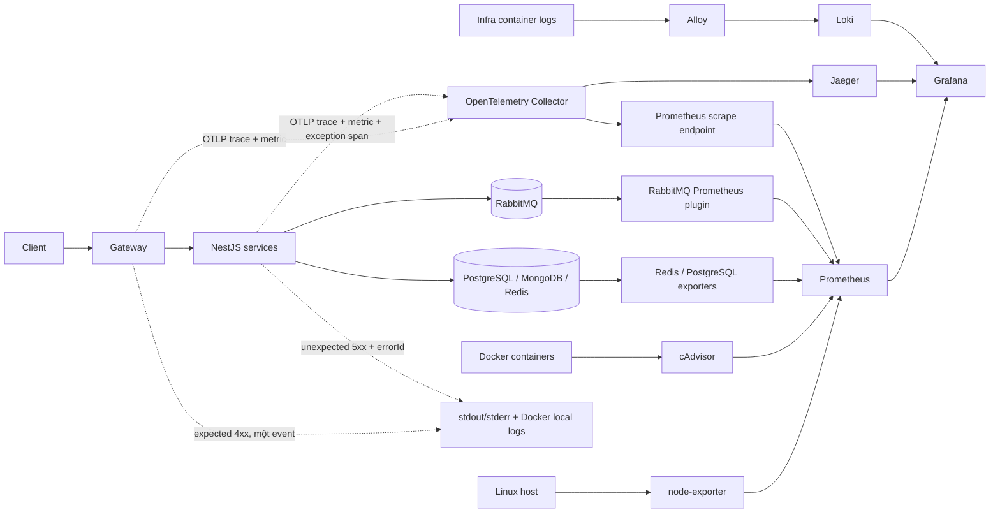

# Hướng dẫn luồng observability và cấu hình backend

> Cập nhật: 2026-08-24
>
> Phạm vi: `gateway`, `auth`, `user`, `mail`, `chat`, `todo`,
> `workschedule`, `canteen`, `payment` và stack trong `logger/compose.yaml`.

## 1. Kết luận sử dụng

Backend hiện tách observability thành các luồng độc lập theo đúng mục đích:

| Tín hiệu                         | Nơi gửi và lưu                                                                       | Dùng để làm gì                                               |
| -------------------------------- | ------------------------------------------------------------------------------------ | ------------------------------------------------------------ |
| Distributed trace/latency        | OpenTelemetry SDK -> OTel Collector -> Jaeger                                        | Xem request đi qua service nào, span nào chậm hoặc lỗi       |
| Host/container/dependency metric | node-exporter, cAdvisor, RabbitMQ/Redis/PostgreSQL exporter -> Prometheus -> Grafana | CPU, RAM, disk, container, queue, connection và health       |
| Expected `4xx`                   | Một event tại Gateway; public entry riêng của Payment áp dụng cùng policy            | Dev xem ngay trong terminal; đồng thời tăng metric rejection |
| Unexpected `5xx`                 | Một structured error tại service phát sinh + exception trên active span              | Tra bằng `errorId`, `trace_id` và `request_id`               |
| Application stdout/stderr        | Docker logging driver `local`                                                        | Debug/nghiệp vụ ngắn hạn trên chính host chạy container      |
| System/infra log                 | Alloy -> Loki -> Grafana Explore                                                     | Tra log của stack observability, Redis, RabbitMQ, PostgreSQL |

Không cần Sentry, Sentry Cloud hay một error center cloud trong giai đoạn này.
Ứng dụng cũng không POST log đồng bộ tới một `logger-service`. Toàn bộ stack hiện
tại tự host bằng Docker Compose, không cần tạo tài khoản SaaS, DSN hay API key
observability.

Grafana chỉ là lớp hiển thị/truy vấn. Prometheus lưu metric, Jaeger lưu trace và
Loki lưu system log; Grafana không thay thế các backend dữ liệu này.

## 2. Sơ đồ luồng thực tế



### Luồng correlation

- Gateway luôn tạo canonical `x-request-id` mới và trả lại header này cho
  client. ID hợp lệ do client gửi chỉ được giữ riêng làm `x-client-request-id`.
- OpenTelemetry tự quản lý `traceparent`/`tracestate` qua HTTP.
- Publisher/consumer RabbitMQ inject/extract W3C trace context trong message
  header. Auto-instrumentation `amqplib` được tắt để không tạo span trùng.
- Logger tự thêm `trace_id`, `span_id`, `request_id`, `service.name`, release và
  environment khi context tương ứng đang active.
- `requestId` hỗ trợ người dùng/terminal; `trace_id` là correlation chuẩn xuyên
  service; `errorId` định danh một unexpected error cụ thể.

## 3. Quy tắc lỗi và log

### Expected `4xx`

- Gateway ghi đúng một event `http.request.rejected` cho response `4xx` đi qua
  public edge.
- `400/401/404/409/422` dùng `info`; `403/429` dùng `warn` theo policy hiện tại.
- Production mặc định sample log `404` ở mức `0.1`; đổi bằng
  `LOG_HTTP_404_SAMPLE_RATE` trong khoảng `0..1`. Metric rejection vẫn được tăng
  trước bước sample log.
- Validation chỉ ghi danh sách tên field sai, không ghi giá trị đầu vào.
- Downstream không ghi lại expected business error.
- Expected `4xx` không có `errorId`, không gửi cloud và không được xem là
  exception tập trung.

Payment có webhook/callback công khai không đi qua Gateway. Đặt
`PAYMENT_PUBLIC_ENTRY_LOG_REJECTIONS=true` để boundary của Payment ghi một event
`4xx` theo cùng policy.

### Unexpected `5xx`

- Service nơi lỗi phát sinh ghi một structured event ở `error`/`fatal`, gồm
  stack đã sanitize và `error.id`.
- Cùng exception được record trên active Jaeger span.
- Response an toàn trả field `errorId`; không trả stack, DB message, URL nội bộ
  hoặc secret.
- Nếu lỗi đi qua Gateway, Gateway chỉ ghi summary upstream và giữ nguyên
  `errorId`; Gateway không in lại stack gốc.
- RabbitMQ/outbox ghi failure có ý nghĩa khi hết policy retry, tránh một lần
  retry tạo một error trùng.

Ví dụ response `5xx`:

```json
{
  "statusCode": 500,
  "code": "INTERNAL_ERROR",
  "message": "Internal server error",
  "requestId": "...",
  "errorId": "..."
}
```

Pino xuất `trace` đến `warn` ra stdout, `error`/`fatal` ra stderr. Docker logging
driver thu cả hai stream. Không log password, OTP, token, cookie, authorization
header, email/phone không cần thiết, payment payload, chat content hoặc toàn bộ
request/response body.

## 4. Thành phần và cấu hình đã pin

`logger/compose.yaml` hiện dùng các image sau:

| Thành phần        | Image/version                                     | Trách nhiệm                                    |
| ----------------- | ------------------------------------------------- | ---------------------------------------------- |
| Jaeger            | `cr.jaegertracing.io/jaegertracing/jaeger:2.20.0` | Lưu/hiển thị trace local                       |
| OTel Collector    | `otel/opentelemetry-collector:0.159.0`            | Nhận OTLP, batch/retry, xuất trace/metric      |
| Prometheus        | `prom/prometheus:v3.12.0`                         | Scrape, lưu metric và đánh giá alert rule      |
| Grafana           | `grafana/grafana:13.2.0`                          | Dashboard/Explore cho Prometheus, Jaeger, Loki |
| node-exporter     | `prom/node-exporter:v1.11.1`                      | Metric Linux host                              |
| cAdvisor          | `ghcr.io/google/cadvisor:v0.57.0`                 | Metric Docker container                        |
| redis_exporter    | `oliver006/redis_exporter:v1.89.0-alpine`         | Metric Redis                                   |
| postgres_exporter | `prometheuscommunity/postgres-exporter:v0.20.1`   | Metric Payment PostgreSQL                      |
| Loki              | `grafana/loki:3.7.0`                              | Lưu system/infra log local                     |
| Alloy             | `grafana/alloy:v1.18.0`                           | Discover Docker và chuyển system log vào Loki  |

RabbitMQ image `rabbitmq:4.2.7-management-alpine` bật sẵn
`rabbitmq_prometheus` bằng `docker/rabbitmq-enabled-plugins`; endpoint metric nội
bộ là `rabbitmq:15692`.

## 5. Yêu cầu trước khi chạy

- Docker Engine có Docker Compose plugin (`docker compose`). Linux là môi trường
  phù hợp nhất vì node-exporter/cAdvisor cần đọc host filesystem, cgroup và
  Docker state.
- Node.js `>=20.19` và npm nếu chạy service trực tiếp trên host.
- MongoDB đang chạy và truy cập được. Root Compose không dựng MongoDB; các
  service dùng Mongo phải có `MONGO_URL` đúng trong file `.env` của mình.
- Các cổng host ở mục 8 chưa bị ứng dụng khác chiếm.

Kiểm tra nhanh:

```bash
docker version
docker compose version
node --version
npm --version
```

## 6. Chuẩn bị file môi trường

Chạy từ thư mục `backend`. Các lệnh sau không ghi đè file `.env` đã tồn tại:

```bash
test -f .env || cp .env.example .env
test -f logger/.env || cp logger/.env.example logger/.env

for service in gateway auth user mail chat todo workschedule canteen payment; do
  test -f "$service/.env" || cp "$service/.env.example" "$service/.env"
done
```

Sau đó mở các file vừa tạo và thay toàn bộ giá trị `CHANGE_ME`/`replace_with`.
Không commit `.env` hoặc secret thật.

### Biến root bắt buộc

`backend/.env` là contract chung cho hai Compose project. Tối thiểu phải khai
báo:

```dotenv
COMPOSE_PROJECT_NAME=nrapp-backend
OBSERVABILITY_COMPOSE_PROJECT_NAME=nrapp-observability
OBSERVABILITY_NETWORK_NAME=nrapp-observability

RABBITMQ_USER=nrapp_dev
RABBITMQ_PASSWORD=<mat-khau-manh>

PAYMENT_POSTGRES_USER=nrapp_payment
PAYMENT_POSTGRES_PASSWORD=<mat-khau-manh-khac>
PAYMENT_POSTGRES_DB=nrapp_payment

CANTEEN_INTERNAL_SECRET=<toi-thieu-32-ky-tu>
PAYMENT_INTERNAL_SECRET=<toi-thieu-32-ky-tu>
USER_INTERNAL_SECRET=<toi-thieu-32-ky-tu>
CHAT_INTERNAL_SECRET=<toi-thieu-32-ky-tu>
TODO_INTERNAL_SECRET=<toi-thieu-32-ky-tu>
WORKSCHEDULE_INTERNAL_SECRET=<toi-thieu-32-ky-tu>

OTEL_TRACES_SAMPLER_ARG=1
OTEL_METRIC_EXPORT_INTERVAL=15000
```

Giữ cùng giá trị `OBSERVABILITY_NETWORK_NAME` cho cả backend và observability
Compose. Có thể sinh secret local bằng `openssl rand -hex 32`.

Hai Compose project phải có tên khác nhau. Wrapper
`scripts/observability-compose.mjs` luôn truyền project name observability riêng,
vì vậy `observability:down` không thể xóa nhầm container backend ngay cả khi
`COMPOSE_PROJECT_NAME=nrapp-backend` còn trong root `.env`.

Các biến `*_HOST_PORT` và `GATEWAY_BIND_IP` trong `.env.example` là tùy chọn để
đổi port/bind address. Mặc định chỉ Gateway bind `0.0.0.0`; UI, database và
message broker chỉ bind `127.0.0.1`.

### Biến Grafana bắt buộc

`logger/.env` tối thiểu cần:

```dotenv
GRAFANA_ADMIN_USER=admin
GRAFANA_ADMIN_PASSWORD=<mat-khau-admin-manh>
```

`GRAFANA_ADMIN_PASSWORD` không được để trống. Với volume Grafana đã khởi tạo,
đổi biến môi trường không tự đổi mật khẩu cũ trong database Grafana.

### Biến observability của từng app

Khi chạy Docker, root Compose đã đặt endpoint OTLP và `service.name` riêng cho
từng container. Khi deploy ngoài Compose, phải khai báo rõ:

```dotenv
LOG_LEVEL=info
LOG_FORMAT=json
OTEL_SERVICE_NAME=payment
OTEL_SERVICE_VERSION=<git-sha-hoac-release>
DEPLOYMENT_ENVIRONMENT=production
OTEL_EXPORTER_OTLP_ENDPOINT=http://otel-collector:4318
OTEL_EXPORTER_OTLP_PROTOCOL=http/protobuf
OTEL_PROPAGATORS=tracecontext,baggage
OTEL_TRACES_SAMPLER=parentbased_traceidratio
OTEL_TRACES_SAMPLER_ARG=<ty-le-tu-0-den-1>
OTEL_METRIC_EXPORT_INTERVAL=15000
OTEL_HTTP_IGNORE_INCOMING_PATHS=/health,/healthz,/ready,/readiness
```

App chạy trên host dùng `http://127.0.0.1:4318`; app chạy trong Docker network
dùng `http://otel-collector:4318`. Không dùng `localhost` trong app container.

### Hai biến Payment phải cấu hình rõ

Thêm vào `payment/.env`:

```dotenv
# Số lần outbox publish tối đa trước khi đánh dấu failure. Phải là số nguyên > 0.
PAYMENT_OUTBOX_MAX_ATTEMPTS=8

# Bật log một lần cho 4xx tại webhook/callback công khai không qua Gateway.
PAYMENT_PUBLIC_ENTRY_LOG_REJECTIONS=false
```

Code fallback `PAYMENT_OUTBOX_MAX_ATTEMPTS` về `8` nếu thiếu/không hợp lệ, nhưng
production nên khai báo rõ để thay đổi có kiểm soát. Biến
`PAYMENT_PUBLIC_ENTRY_LOG_REJECTIONS` chỉ bật khi giá trị là chuỗi `true`; mặc
định thiếu biến là tắt. Giữ `false` khi webhook/callback đi qua Gateway để tránh
log trùng. Chỉ đặt `true` khi reverse proxy hoặc nhà cung cấp gọi trực tiếp
Payment và Payment thực sự là public edge của route đó.

Các secret/DB/SMTP/Cloudinary/JWT còn lại vẫn lấy từ `.env.example` của từng
service. Secret ký ở Gateway và service nhận phải giống nhau.

## 7. Cài dependency và chạy local

### Cài npm dependency

```bash
for service in gateway auth user mail chat todo workschedule canteen payment; do
  (cd "$service" && npm ci)
done
```

### Chỉ dựng observability

```bash
npm run observability:config
npm run observability:up
```

Lệnh `observability:up` dùng đồng thời `backend/.env` và `logger/.env`, tạo
network mặc định `nrapp-observability` rồi chờ container khởi động.

### Dựng observability cùng Redis/RabbitMQ/PostgreSQL

```bash
npm run infra:up
```

Đây là lựa chọn phù hợp để chạy backend trực tiếp trên host. Script khởi động
observability trước để external network tồn tại, sau đó dựng Redis, RabbitMQ và
Payment PostgreSQL.

### Chạy cả 9 service trực tiếp trên host

```bash
npm run dev
```

`npm run dev` tự:

1. dừng app container đang chạy để tránh trùng port;
2. dựng observability và ba dependency;
3. inject endpoint OTLP host `http://127.0.0.1:4318`;
4. chạy 9 service với `LOG_FORMAT=pretty` và prefix tên service.

Nếu infra đã chạy và chỉ muốn chạy lại app:

```bash
npm run dev:apps
```

### Chạy toàn bộ app bằng Docker

```bash
docker compose --profile app config --quiet
npm run docker:up
```

`docker:up` tự dựng observability trước rồi build/start profile `app`. Không chạy
đồng thời `npm run dev` và `npm run docker:up` vì cùng dùng các host port.

MongoDB không nằm trong root Compose. Khi chạy toàn bộ app trong Docker,
`MONGO_URL` phải trỏ tới MongoDB mà container truy cập được; `localhost` lúc này
là chính app container.

## 8. URL và cổng mặc định

Các port có thể đổi bằng biến tương ứng trong `.env`/`logger/.env`.

| Thành phần               | URL/cổng host                    | Ghi chú                                      |
| ------------------------ | -------------------------------- | -------------------------------------------- |
| Gateway                  | <http://127.0.0.1:3000>          | Compose mặc định bind Gateway `0.0.0.0:3000` |
| Grafana                  | <http://127.0.0.1:3001>          | Login bằng `GRAFANA_ADMIN_USER/PASSWORD`     |
| Jaeger UI                | <http://127.0.0.1:16686>         | Tra waterfall/latency/error span             |
| Prometheus UI            | <http://127.0.0.1:9090>          | Targets, query metric, alert rule            |
| OTel Collector OTLP gRPC | `127.0.0.1:4317`                 | App host nếu dùng gRPC                       |
| OTel Collector OTLP HTTP | <http://127.0.0.1:4318>          | App host dùng OTLP HTTP/protobuf             |
| OTel Collector health    | <http://127.0.0.1:13133>         | Health extension                             |
| Loki                     | <http://127.0.0.1:3100/ready>    | Chỉ system/infra log                         |
| Alloy                    | <http://127.0.0.1:12345/-/ready> | Pipeline health/UI local                     |
| RabbitMQ Management      | <http://127.0.0.1:15672>         | Login bằng root RabbitMQ credentials         |
| RabbitMQ AMQP            | `127.0.0.1:5672`                 | App host                                     |
| Redis                    | `127.0.0.1:6379`                 | Không có UI                                  |
| Payment PostgreSQL       | `127.0.0.1:5433`                 | Container dùng port `5432`                   |

App service host ports: Auth `4000`, User `5000`, Mail `5001`, Chat `5002`, Todo
`5003`, Workschedule `5004`, Canteen `5005`, Payment `5006`.

node-exporter (`9100`), cAdvisor (`8080`), redis_exporter (`9121`),
postgres_exporter (`9187`), RabbitMQ metrics (`15692`) và Collector self/app
metric (`8888`/`8889`) chỉ expose trong Docker network, không publish ra host.

Grafana tự provision ba datasource:

- `Prometheus` (mặc định);
- `Jaeger`;
- `Loki`.

Dashboard được provision vào folder `Infrastructure`:

- `Infrastructure overview`;
- `Backend dependencies`.

## 9. Kiểm tra sau khi setup

### Health và scrape target

```bash
curl -fsS http://127.0.0.1:13133/
curl -fsS http://127.0.0.1:3100/ready
curl -fsS http://127.0.0.1:12345/-/ready
curl -fsS http://127.0.0.1:9090/-/ready
curl -fsS http://127.0.0.1:3001/api/health
```

Mở <http://127.0.0.1:9090/targets>. Khi chạy `npm run infra:up`, các job dự
kiến gồm Prometheus, node-exporter, cAdvisor, Redis, PostgreSQL, RabbitMQ,
Collector, application metrics, Jaeger, Loki, Alloy và Grafana. Target `DOWN`
không đồng nghĩa API business đã lỗi; phải kiểm tra đúng exporter/dependency.

PromQL kiểm tra nhanh:

```promql
up
```

```promql
sum(rate(otelcol_receiver_accepted_spans[5m]))
```

```promql
sum by (queue) (rabbitmq_queue_messages_ready)
```

```promql
sum by (datname) (pg_stat_activity_count)
```

Metric `http.server.request.rejections` do app phát sẽ được Prometheus exporter
chuẩn hóa theo naming convention. Để tránh đoán suffix theo phiên bản exporter,
mở Prometheus autocomplete/Metric Explorer và tìm prefix
`http_server_request_rejections` sau khi đã tạo ít nhất một response `4xx`.

### Tạo và xem trace

Khi Gateway đang chạy, tạo một request test không chứa dữ liệu nhạy cảm:

```bash
curl -i -H 'x-request-id: obs-demo-001' \
  http://127.0.0.1:3000/__observability-check
```

Gateway sẽ tạo canonical `x-request-id` mới trong response; ID client trên chỉ
là `x-client-request-id`. Sau vài giây:

1. mở <http://127.0.0.1:16686>;
2. chọn service `gateway`;
3. chọn khoảng thời gian gần nhất rồi bấm **Find Traces**;
4. mở trace để xem span HTTP, status và latency;
5. với luồng thật Gateway -> downstream -> DB/RabbitMQ, kiểm tra tất cả span có
   cùng Trace ID và parent/child đúng.

Health/readiness path bị ignore khỏi incoming HTTP instrumentation theo mặc định,
vì vậy không dùng `/health` để thử trace.

### Tra `errorId` và `trace_id`

Chỉ unexpected `5xx` mới trả `errorId`. Sao chép ID từ response rồi tra service
origin, ví dụ Payment:

```bash
docker compose --profile app logs --since=30m payment | rg '<errorId>'
```

Nếu máy chưa có ripgrep, thay `rg` bằng `grep -F`. Event JSON origin chứa
`error.id`, `trace_id`, `span_id`, `request_id` và stack server-side đã sanitize.
Lấy `trace_id` từ event rồi mở Jaeger và tra Trace ID đó. Nếu request đi qua
Gateway, có thể tra cùng `errorId` trong Gateway log để thấy summary, nhưng stack
gốc chỉ nằm tại origin.

Khi chạy `npm run dev`, terminal đã có prefix `[payment]`, `[gateway]`... nên có
thể tìm trực tiếp trong output hoặc chuyển output vào file local do dev quản lý.

### Xem system/infra log

Application log cố ý không được gửi vào Loki. Trong Grafana vào **Explore ->
Loki** và dùng:

```logql
{log_scope="system"}
```

Có thể lọc tiếp theo `service`, `container` hoặc `compose_project`. Muốn xem app
log, dùng terminal hoặc `docker compose logs`, không tìm trong Loki.

## 10. Dashboard và alert hiện có

Prometheus đánh giá rule mỗi 15 giây. Rule hiện gồm:

- scrape target down;
- host CPU/RAM cao, filesystem còn dưới 10%;
- Collector từ chối span hoặc export span thất bại;
- RabbitMQ ready backlog trên 1.000 message;
- PostgreSQL connection trên 85%;
- Redis memory trên 85% khi Redis có cấu hình max memory.

Xem rule tại <http://127.0.0.1:9090/alerts>. Stack chưa cấu hình Alertmanager hay
contact point production. Vì vậy rule có thể chuyển sang `FIRING` nhưng chưa gửi
Discord/Telegram/email. Kênh notification và owner phải được chốt riêng trước
production; business code không gọi webhook cảnh báo.

## 11. Retention và giới hạn hiện tại

| Dữ liệu           | Retention hiện tại                           | Giới hạn                                                                                              |
| ----------------- | -------------------------------------------- | ----------------------------------------------------------------------------------------------------- |
| App stdout/stderr | Docker `local`, `10m x 3 file` mỗi container | Rotation theo dung lượng; remove/recreate/down có thể làm lịch sử cũ không còn phù hợp để tra lâu dài |
| Prometheus        | `15d` mặc định (`PROMETHEUS_RETENTION`)      | Named volume local, single host                                                                       |
| Loki system log   | `168h` (7 ngày)                              | Filesystem, replication `1`, không auth                                                               |
| Jaeger trace      | In-memory all-in-one                         | Restart/recreate Jaeger làm mất trace                                                                 |
| Grafana config    | Named volume `grafana_data`                  | Local SQLite/volume, chưa HA                                                                          |

`docker compose down` không xóa named volume nếu không thêm `--volumes`. Không
chạy `down --volumes` nếu chưa chủ động chấp nhận mất Prometheus/Loki/Grafana và
dữ liệu dependency.

## 12. Production hardening

Cấu hình Compose hiện tại là local/single-host baseline, chưa phải production
HA. Trước production cần thực hiện tối thiểu:

1. Thay Jaeger in-memory bằng persistent backend. Jaeger v2 hỗ trợ
   Elasticsearch/OpenSearch/Cassandra; sau sizing, OpenSearch là lựa chọn phù
   hợp khi cần search production. Chốt TTL, disk, shard, backup và restore test.
2. Chốt Prometheus/Loki/Jaeger retention theo traffic, disk budget và thời gian
   điều tra; tạo disk/inode alert trước khi tăng retention.
3. Đặt Jaeger, Prometheus, Grafana, Loki, Alloy và OTLP ingestion sau private
   network/VPN hoặc reverse proxy TLS. Hiện chỉ Grafana có login; không expose
   trực tiếp các port local ra Internet.
4. Đưa secret vào secret manager/Compose secrets/Kubernetes Secrets; không để
   credential trong Git, command history, dashboard label hoặc trace attribute.
5. Giới hạn người được đọc Docker socket. Alloy mount Docker socket read-only
   nhưng vẫn đọc được nhiều metadata; cAdvisor hiện cần `privileged` và host
   mounts.
6. Đặt resource limit, restart policy, healthcheck, backup và runbook cho stack
   theo nền tảng deploy thực tế.
7. Cấu hình `OTEL_SERVICE_VERSION` bằng Git SHA/release thật để phân biệt
   regression giữa các bản deploy.
8. Giữ telemetry fail-open: Collector/Jaeger/Prometheus hỏng không được làm API
   business thất bại hoặc chờ vô hạn.

### Sampling production

Local dùng:

```dotenv
OTEL_TRACES_SAMPLER=parentbased_traceidratio
OTEL_TRACES_SAMPLER_ARG=1
```

`1` nghĩa là giữ 100% trace. Production phải đo request rate, kích thước span,
CPU/RAM và dung lượng storage rồi chọn tỷ lệ `0..1`; không sao chép mặc định `1`
một cách máy móc. Head sampling hiện tại có thể bỏ mất trace lỗi. Nếu yêu cầu
luôn giữ error/slow trace, bổ sung tail sampling tại Collector sau khi sizing
memory/queue; không tự viết sampling trong từng service.

Không dùng `request_id`, `trace_id`, `errorId`, user ID, email hoặc raw URL làm
Prometheus label vì cardinality cao.

## 13. Troubleshooting

### Compose báo thiếu biến

Chạy lại bước tạo `.env`, điền root DB/RabbitMQ credentials và
`GRAFANA_ADMIN_PASSWORD`, sau đó:

```bash
npm run observability:config
docker compose --profile app config --quiet
```

Không dùng lệnh in toàn bộ resolved Compose config lên ticket/chat vì có thể lộ
credential.

### Báo external network `nrapp-observability` không tồn tại

Phải dựng observability trước:

```bash
npm run observability:up
```

`npm run infra:up` và `npm run docker:up` đã thực hiện đúng thứ tự này. Nếu đổi
`OBSERVABILITY_NETWORK_NAME`, đổi cùng giá trị ở cả hai Compose project.

### Không thấy trace trong Jaeger

1. xác nhận Collector health ở port `13133`;
2. app host dùng `127.0.0.1:4318`, app container dùng
   `otel-collector:4318`;
3. kiểm tra `OTEL_TRACES_SAMPLER_ARG` không bằng `0`;
4. không dùng health/readiness path để test;
5. xem log Collector/Jaeger:

```bash
node scripts/observability-compose.mjs \
  logs --tail=200 otel-collector jaeger
```

Telemetry bootstrap phải chạy trước khi Nest/HTTP/database driver được import.
Các service hiện dùng package `@nrapp/observability/register`; không bỏ preload
hoặc side-effect import đầu entrypoint.

### Prometheus target `DOWN`

Mở `/targets` để biết đúng job, sau đó kiểm tra:

```bash
docker compose ps redis rabbitmq payment-postgres
node scripts/observability-compose.mjs ps
```

- RabbitMQ: xác nhận file `docker/rabbitmq-enabled-plugins` còn
  `rabbitmq_prometheus`.
- Redis/PostgreSQL: dependency phải cùng network observability và credential
  exporter phải đúng.
- `application-metrics`: chờ ít nhất một chu kỳ
  `OTEL_METRIC_EXPORT_INTERVAL` cộng một scrape interval 15 giây.
- node-exporter/cAdvisor trên Docker Desktop đo Linux VM của Docker, không phản
  ánh hoàn toàn host Windows/macOS; host mount/cgroup cũng có thể khác Linux.

### Có `5xx` nhưng không thấy `errorId`

- Xác nhận đó thật sự là unexpected error; expected `4xx` không có `errorId`.
- Tra response/log tại service public origin. Gateway chỉ giữ summary cho lỗi
  upstream.
- Nếu lỗi xảy ra trước khi HTTP exception boundary khởi tạo (ví dụ bootstrap
  fatal), chỉ có server-side fatal event, không có HTTP response để trả ID.

### Không thấy application log trong Loki

Đây là hành vi đúng. Alloy chỉ keep container observability, Redis, RabbitMQ và
PostgreSQL. Dùng:

```bash
docker compose --profile app logs --since=30m gateway payment
```

### Jaeger trống sau restart

Jaeger Compose hiện dùng memory storage. Trace mất sau restart là giới hạn đã
biết của local stack, không phải lỗi Collector. Production phải cấu hình
persistent backend.

### Grafana không nhận mật khẩu mới

Biến admin password chỉ áp dụng lúc database Grafana được khởi tạo lần đầu.
Nếu volume `grafana_data` đã tồn tại, dùng Grafana CLI reset admin theo tài liệu
chính thức hoặc backup rồi tạo lại riêng volume Grafana. Không xóa tất cả volume
chỉ để sửa mật khẩu.

### `npm run dev` báo trùng port

Script kiểm tra đủ 9 host port trước khi spawn app. Dừng process cũ hoặc đổi
`*_HOST_PORT` trong `backend/.env`; không chạy host app và app container đồng
thời.

## 14. Dừng và rollback

### Dừng nhưng giữ dữ liệu

```bash
npm run docker:down
npm run observability:down
```

Nếu chỉ chạy host development, nhấn `Ctrl+C` để dừng app; script chủ động giữ
Redis/RabbitMQ/PostgreSQL. Dừng ba dependency bằng:

```bash
npm run infra:down
```

### Tạm tắt telemetry SDK

Khi cần cô lập sự cố exporter/SDK mà vẫn giữ structured logging:

```dotenv
OTEL_SDK_DISABLED=true
```

Restart app sau khi đổi biến. API vẫn ghi stdout/stderr, nhưng không gửi trace
hay application metric. Nếu backend container vẫn khai báo external network,
giữ network observability tồn tại cho tới khi đã deploy Compose config mới;
không xóa network giữa lúc các app đang dùng nó.

### Rollback release

- Rollback package/app theo commit release của từng service, không copy lại các
  logger/filter cũ bằng tay.
- Telemetry rollback không đồng nghĩa rollback Payment database/outbox schema.
  Migration tài chính phải theo release plan và backup riêng; không tự động
  revert khi chỉ muốn tắt tracing.
- Giữ named volume trong rollback window. Chỉ dùng `down --volumes` khi đã xác
  nhận chính xác project/volume và chấp nhận mất dữ liệu local.

## 15. Link cài đặt và tài liệu chính thức

Trong repository này, Docker Compose tự pull các image đã pin nên chỉ Docker là
bắt buộc; Node.js chỉ bắt buộc nếu chạy app trên host. Các link còn lại dùng khi
cần xem cách cài độc lập hoặc chuyển sang production platform.

| Công cụ                                     | Link chính thức                                                                                                                                                                                                  |
| ------------------------------------------- | ---------------------------------------------------------------------------------------------------------------------------------------------------------------------------------------------------------------- |
| Docker Engine                               | [Install Docker Engine](https://docs.docker.com/engine/install/)                                                                                                                                                 |
| Docker Compose plugin                       | [Install Docker Compose](https://docs.docker.com/compose/install/)                                                                                                                                               |
| Node.js                                     | [Download Node.js](https://nodejs.org/en/download)                                                                                                                                                               |
| OpenTelemetry Collector                     | [Install Collector](https://opentelemetry.io/docs/collector/install/) và [chạy bằng Docker](https://opentelemetry.io/docs/collector/install/docker/)                                                             |
| Jaeger v2                                   | [Jaeger 2.20 getting started](https://www.jaegertracing.io/docs/2.20/getting-started/), [download](https://www.jaegertracing.io/download/) và [storage backend](https://www.jaegertracing.io/docs/2.20/storage/) |
| Prometheus                                  | [Prometheus installation](https://prometheus.io/docs/prometheus/latest/installation/)                                                                                                                            |
| Grafana                                     | [Run Grafana bằng Docker](https://grafana.com/docs/grafana/latest/setup-grafana/installation/docker/)                                                                                                            |
| node-exporter                               | [Prometheus node_exporter](https://github.com/prometheus/node_exporter) và [host metric guide](https://prometheus.io/docs/guides/node-exporter/)                                                                 |
| cAdvisor                                    | [cAdvisor repository/quick start](https://github.com/google/cadvisor)                                                                                                                                            |
| RabbitMQ Prometheus plugin                  | [RabbitMQ monitoring với Prometheus/Grafana](https://www.rabbitmq.com/docs/4.2/prometheus)                                                                                                                       |
| redis_exporter                              | [oliver006/redis_exporter](https://github.com/oliver006/redis_exporter)                                                                                                                                          |
| postgres_exporter                           | [prometheus-community/postgres_exporter](https://github.com/prometheus-community/postgres_exporter)                                                                                                              |
| Loki                                        | [Install Loki](https://grafana.com/docs/loki/latest/setup/install/)                                                                                                                                              |
| Grafana Alloy                               | [Install Grafana Alloy](https://grafana.com/docs/alloy/latest/set-up/install/)                                                                                                                                   |
| OpenSearch (tùy chọn cho Jaeger production) | [Install OpenSearch bằng Docker](https://docs.opensearch.org/latest/install-and-configure/install-opensearch/docker/)                                                                                            |

OpenSearch chưa nằm trong Compose hiện tại và không cần cài cho local. Chỉ thêm
sau khi đã chốt production trace retention, capacity, HA, backup và quyền truy
cập. Sentry cũng không phải dependency của kiến trúc này.
